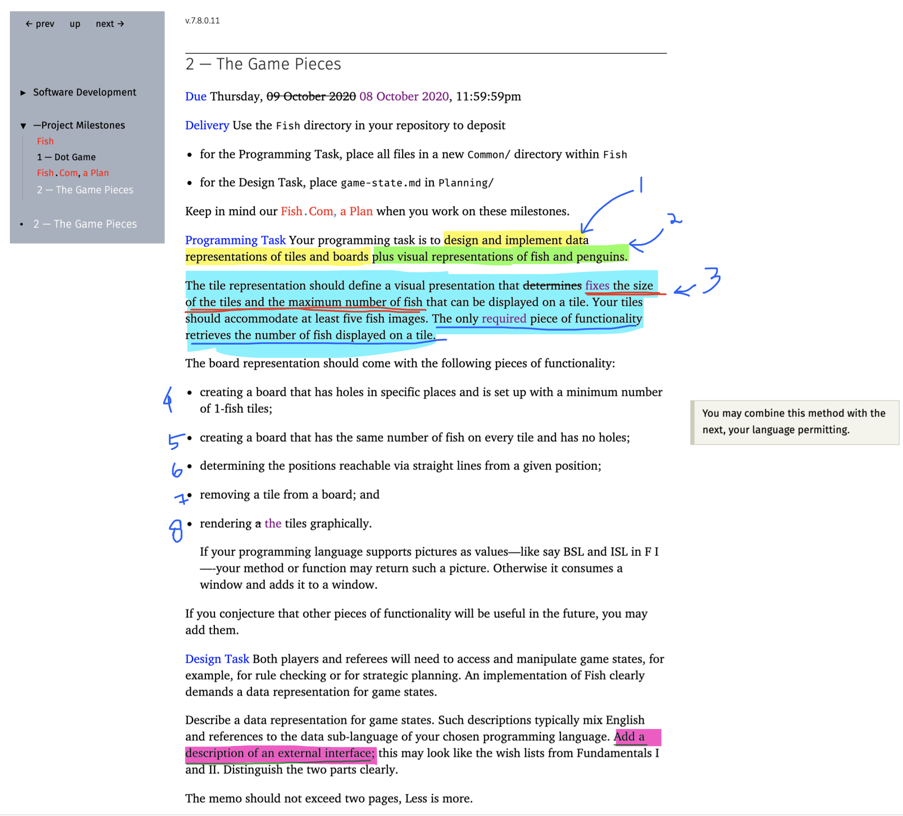

| Problem Spec Requirement \# | Description                                                                                                                                                                                                 | Notes                                                                             |
|-----------------------------|-------------------------------------------------------------------------------------------------------------------------------------------------------------------------------------------------------------|-----------------------------------------------------------------------------------|
| 1                           | Data representations of: a) tiles. b) boards                                                                                                                                                                    | Defined in game\-state\.md and within the code                                    |
| 2                           | Visual representations of fish and penguins                                                                                                                                                                 | Dedined in assets/                                                                |
| 3                           | Tile representation a\) should define a visual presentation that fixes the size of the tiles, b\) should define a visual presentation that fixes the maximum number of fish that can be displayed on a tile | See \`Tile`                                                           |
| 4                           | Create a board that a\) has a specific number of holes at specific places b\) has a minimum number of 1\-fish tiles\.                                                                                       | addBoardHolesMinFish : Board Number Posn\[\] \-> Board                            |
| 5                           | Create a board that has a\) has the same number of fish on every tile\. b\) has no holes                                                                                                                    | dimensionToBoard : Number Number \-> Board                                        |
| 6                           | determine the positions reachable via straight lines from a given position                                                                                                                                  | getReachable : Board Posn \-> Posn\[\]                                            |
| 7                           | remove a tile from a board                                                                                                                                                                                  | removeTile : Board Posn \-> Board                                                 |
| 8                           | render the tiles graphically                                                                                                                                                                                | allHexes : Number Number Number \-> void BUT should be Board \-> void |

