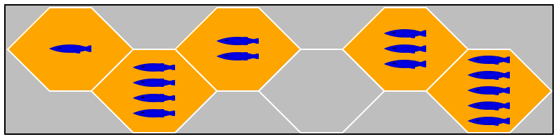
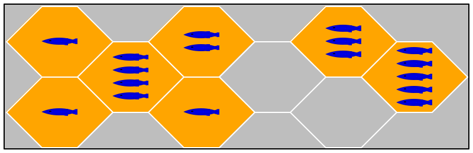

# `3 — The Game State`

**Due** Thursday, 15 October 2020, 11:59:59pm

**Delivery** Place the product of this week’s project steps into your repo as follows:

- for the Design Task, place `games.md` in `Planning/`
- for the Programming Task, place `state.PP` in `Common/`
- for the Testing task, place `xboard` and `Tests/` in a repo-level directory named `3`

You may create `Other/` directories in both `3` and `Fish`.

**Programming Task** Design and implement a game state data representation, includinng the following operations. A game state represents the current state of a game: the state of the board, the current placements of the penguins, knowledge about the players, and the order in which they play. 

A game state representation may be used by the referee component to perform turns and check rule-conforming behavior. A player component can use it for planning purposes.

The game-state representation should come with the following pieces of functionality: 

- creating a state for a certain number of players;
- place an avatar on behalf of a player;
- move an existing avatar from one spot to another on behalf of the player;
- determine whether any player can move an avatar; and
- rendering the state graphically.

If your programming language supports pictures as values - llike say BSL and ISL in Fundamentals I -- your method of function may return such a picture. Otherwise consumes a window and adds it to a window.

You might need other operations to design these. Consider making those public if you see a need for players or referees to use them.

**Design Task** Both referees and (well-behaved) players will need to check whether an action is legal according to the rules of Fish. A well-chosen data representation will enable two different mechanisms to check rules and to plan a player's next move (based on some look-ahead).

Describe a data represenntation for representing entire games. Roughly speaking, a game is a tree of all potential moves in any state reachable from a given starting point. Assume that the starting point is a state in which all players have placed all their available penguins. Both the referee and the players can use this structure to check the validity of actions or plan ahead.

Such descriptions typically mix english and references to the data sub-language of your chosen programming language. Add a description of an external interface; this may look like the wish lists from Fundamentals I and II. Distinguish the two parts clearly.

The memo must not exceed two pages. Less is more.

**Testing Task** Create a test harness named `xboard`. The harness consumes its JSON input from `STDIN` and produces its results to `STDOUT`. Create three tests and place them in the specified folder.

The tests are formulated as pairs of files: `<n>-in.json`, the input, and `<n>-out.json`, the expected result, for an integer `<n>` greater or equal to `1`.

Its inputs is an object with two fields:

_Board-Posn_ is { "position" : _Position_,  "board" : _Board_ }

_Board_ is JSON array of JSON arrays where each element is either 0 or a number between 1 and 5
The size of the board may not exceed 25 spots. 

_Position_ is a JSON array that contains two natural numbers: [board-row, board-column]. 
INTERPRETATION The position uses the computer graphics coordinate system meaning the Y axis points downwards. The position refers to a tile with at least one fish on it.

Its expected output is the number of tiles on the board that can be reached from the specific position.

Since boards with hexagonal tiles are somewhat unusual, here are two examples that graphically explain how [JSON](https://www.json.org/) board specifications are interpreted:

{"position":[0,0],"board":[[1,2,3],[4,0,5]]}

{"position":[0,0],"board":[[1,2,3],[4,0,5],[1,1,0]]}

Both sample inputs specify the top-most, left-most position as the one to analyze.

**Well-formed and Valid** You may assume that all inputs for your test harnesses will be well-formed JSON and valid according to the homework descriptions. As a reminder, a well-formed _Position_ would be `[1001,2]`, but it would be invalid for the above boards; `[0,1]` would be well-formed and valid for both of these boards.

**Pedagogy**

Besides _unit tests_, multi-component projects also need _integration tests_. Such tests compose several components and run tests on the composite that exercise functions across the components. This task is a lightweight illustration of this idea.

> Beyond integeration testing, we should eventually move to stress testing. The course will touch on this idea in November or December.

You will have to add code to deal with the (de)serialization between your chosen data representation and [JSON](https://www.json.org/).

When a milestone assignment requests such test harnesses, you should not need — but you may have — to modify the core functionality from the previous milestone. Instead, it may suffice to _bridge_ the gap between the external data representation and your internal one within the test harness. This second option tends to be better than changing your code because you don’t run into danger of upsetting well-tested logic.

Like unit tests, an integration test may check properties of expected outcomes, instead of the complete outcome.

You may wish to place unit tests into `Other/` if your chosen programming language does not permit co-mingling tests with the code for xboard within `3`.
