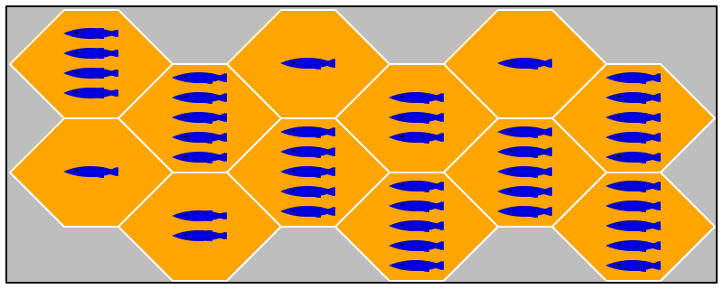
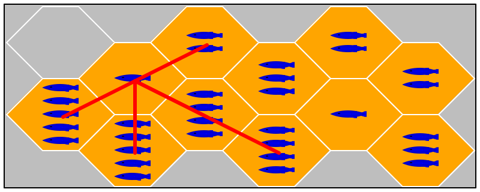

# `Fish`

_Overview_ Fish is a board game for two to four players.

The _game board_ is a grid of hexagonal tiles, each of which displays a positive number of fish. The _player avatars_ come in the shape of penguins, which of course eat fish. The goal of the game is to collect as many fish as possible. 

>  The game is loosely based on [Hey, that’s my fish](https://boardgamegeek.com/boardgame/8203/hey-s-my-fish). But your CEO, aka lead instructor, has modified the rules and the modes of the game. You won’t find any implementation on the web, because nobody else has such strange taste.

At the beginning of the game, the players place their penguins on the board  one-at-a-time in a round-robin fashion; the players take turns in ascending order of their age. Onnce all penguins are placed, the game starts. 

> The words "referee", "player", and such refer to software components not a humane being here, which is why "its" is most appropriate.

During a turn, a player must move one of its penguins across a boundary (not a corner) of hexagons; it may move across several boundaries in a row but the move must be a straight line up to but not including holes in the board and avatars on tiles. The tile on which the penguin rested gets removed from the board and its fish go into the possession of that penguin's player. When the ruen is over, it's the next oldest player's turn, and so on. A player that canot move any of its penguins is skipped. 

The game ends when no player can move a penguin.

**Pieces** Here are images of the two basic game pieces and a randomly constructed board:

a tile: 

a penguin: 

(see "taste" in the margin)

a 4 x 3 board:

4 is the number of rows, 3 the number of columns

**Starting the Game** The referee determines the exact layout of the board, after being told the row by column dimension. Specifically, the referee may wish to remove some tiles from the get-go to make the game challenging. 

Next the referee assigns each player a different penguin-color. The available _Colors_ are: `"red"`, `"white"`, `"brown"`, `"black"`. Each player receivers _6 - N_ penguins where _N_ is the number of players that participate in the game.

Starting with the youngest player, each player gets a turn to place on penguin on a tile. A penguin must not be placed on an empty spot. The players get turns in increasing order of age. The referee will run as many placement rounds as there are penguins per player.

**Playing One Round** Once all players have placed all their penguins, the game begins. Again starting with the youngest player, each player gets a turn at moving one of its penguins.

Suppose the top-most/left-most tile has been removed for some reason, and a player's penguin sits on the tile below to the right. The following disagram then describes the penguin's routes:

Its owner must pick one of the tiles that the lines touch for the next turn.

Each player gets one turn per round. Then the referee starts the next round, again with the youngest player.

**Ending a Game** A game ends when no player can move any of its penguins during a round. The player who caught the most fish wins the game. If several players caught the same number of fish, they are all winners.